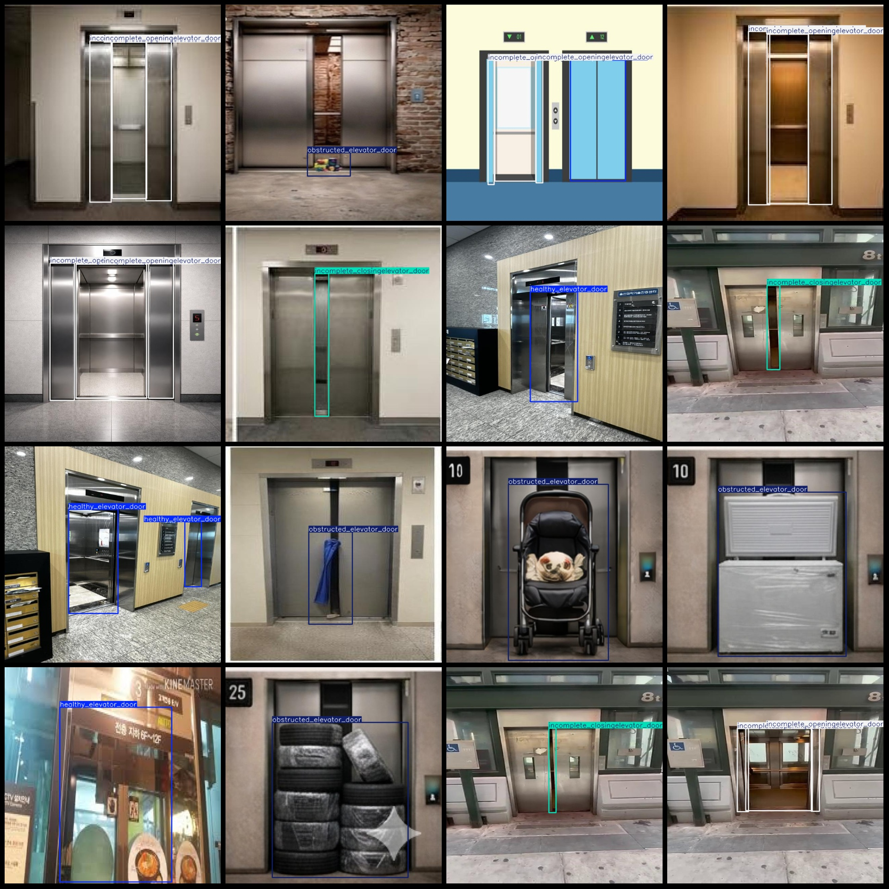

# Elevator Fault Detection Dataset VOC + YOLO format with 1000 images and 5 categories

Dataset format: Pascal VOC format + YOLO format (txt file without split path, only contains jpg images and corresponding VOC format xml files and YOLO format txt files)
Number of images (number of jpg files): 1000  
Number of annotations (number of xml files): 1000  
Number of annotations (number of txt files): 1000
Number of categories: 5
Label: ["healthy_elevator_door", "incomplete_closing_elevator_door", "incomplete_opening_elevator_door", "misalignment_elevator_door", "obstructed_elevator_door"]
Box count for each category:
- healthy_elevator_door (normal elevator door) = 243
- incomplete_closing_elevator_door (elevator door not fully closed) = 200
556
Misalignment_elevator_doorframe count = 224
Obstructed_elevator_doorframe count = 206
Total frame count: 1429
Number of images per category:
Healthy Elevator Door (normal elevator door) images = 203
Incomplete Closing Elevator Door (elevator door not fully closed) images = 200
Incomplete_opening_elevator_door (Elevator door is not fully opened) occupies 200 images.
The number of images with misaligned elevator doors is 200.
The number of images with obstructed elevator doors is also 200.
The image resolution is 640x640.
The annotation tool used is labelImg.
Markdown text:
```
```
Important Notice: The dataset does not have a separate training, validation, and test set; you should partition it yourself.
Special Reminder: This dataset does not guarantee the accuracy of the trained model or weight files.
Image Preview:
## Images




Here is a pay link on Stripe ( https://buy.stripe.com/3cs8yP7sY87d0vu9AB ). Please contact me lonlonago@foxmail.com after funding $89, and I will send you a complete data files , thank you!

